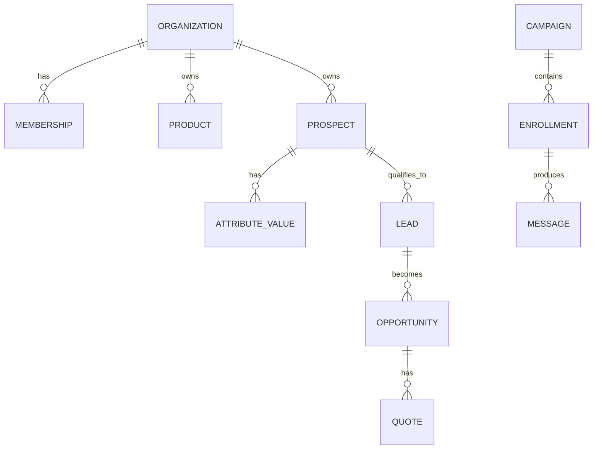

# Relaciones

```mermaid
erDiagram
 ORGANIZATION ||--o{ MEMBERSHIP : has
 ORGANIZATION ||--o{ PRODUCT : owns
 ORGANIZATION ||--o{ PROSPECT : owns
 PROSPECT ||--o{ ATTRIBUTE_VALUE : has
 PROSPECT ||--o{ LEAD : qualifies_to
 CAMPAIGN ||--o{ ENROLLMENT : contains
 ENROLLMENT ||--o{ MESSAGE : produces
 LEAD ||--o{ OPPORTUNITY : becomes
 OPPORTUNITY ||--o{ QUOTE : has
```

Toda relación tenant-a-tenant debe comprobar mismo `organization_id`; referencias globales se declaran explícitamente.
